# FundusGAN-I

```python
from google.colab import drive
drive.mount('/content/drive')
```

    Mounted at /content/drive
    


```python
cd /content/drive/MyDrive/RP/Summer21
```

    /content/drive/MyDrive/RP/Summer21
    


```python
cd Fundus-GAN-version-1/
```

    /content/drive/My Drive/RP/Summer21/Fundus-GAN-version-1
    


**1. Segmentation**


```python
device = 'cuda'
```


```python
from torch.utils.data import DataLoader
import torch
from src.utils.config import *
from src.models.unet import *
from src.models.pix2pix_gen import UNet_pix2pix
from src.dataset.dataset import *
from src.models.discriminator import Discriminator
from train_pix2pix import *
from train import *
device = 'cuda' if torch.cuda.is_available() else 'cpu'
print(device)
```

    cuda
    


```python
train_input_path = datapath_cfg['train_input_path']
train_label_path = datapath_cfg['train_label_path']
batch_size = cfg['batch_size']
print(train_input_path)
```

    /content/drive/MyDrive/RP/Summer21/dataset/newi.tiff
    


```python
train_dataset = unet_dataset(train_input_path, train_label_path)
```


```python
train_dataloader = DataLoader(train_dataset, batch_size=batch_size, shuffle=True)
```


```python
unet = UNet(input_channels=cfg['input_dim'], output_channels=cfg['output_dim']).to(device)
```


```python
unet_opt = torch.optim.Adam(unet.parameters(), lr=cfg['lr'])
```


```python
unet = UNet(input_channels=cfg['input_dim'], output_channels=cfg['output_dim'])
checkpoint = torch.load('/content/drive/MyDrive/RP/F21/Models/UNET/unet_v_26-09-202114:30:12.pth')
unet.load_state_dict(checkpoint['unet'])
unet.to(device)
```


```python
train(model=unet, optimizer=unet_opt, 
      criterion=cfg['criterion'],
      train_dataloader=train_dataloader, 
      input_dim=cfg['input_dim'], 
      label_dim=cfg['output_dim'], 
      target_shape=cfg['target_shape'],
      device=device, save_dir = "/content/drive/MyDrive/RP/F21/Models/UNET")
```

    Epoch 0: Step 5: U-Net loss: 0.05962532386183739
    


    
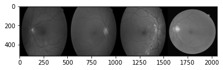
    


    
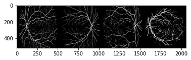
    


    

    


    Epoch 6: Step 205: U-Net loss: 0.04562734067440033
    


    
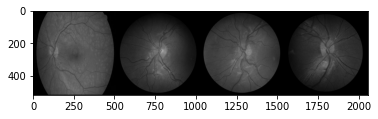
    


    

    


    
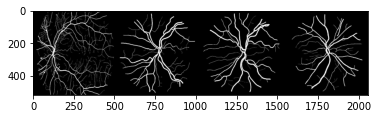
    


    Epoch 11: Step 405: U-Net loss: 0.05267468839883804
    


    
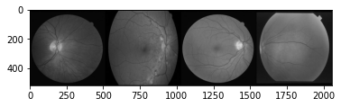
    


    

    


    
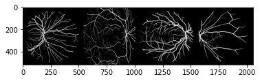
    


    Epoch 17: Step 605: U-Net loss: 0.04996743053197861
    
.
.
.
.

    

.
.
.
.  

    
.
.
.
.  


    Epoch 382: Step 13005: U-Net loss: 0.06173957884311676
    


    
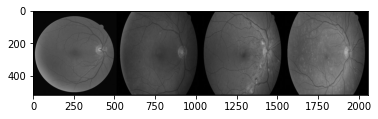
    


    
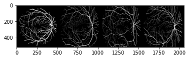
    


    

    


    Epoch 388: Step 13205: U-Net loss: 0.04220299422740936
    


    
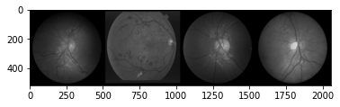
    


    

    


    
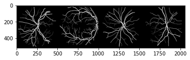
    


    ---------------------------------------------------------------------------

    KeyboardInterrupt                         Traceback (most recent call last)

    <ipython-input-16-5dcd1309c74a> in <module>()
          5       label_dim=cfg['output_dim'],
          6       target_shape=cfg['target_shape'],
    ----> 7       device=device, save_dir = "/content/drive/MyDrive/RP/F21/Models/UNET")
    

    /content/drive/My Drive/RP/Summer21/Fundus-GAN-version-1/train.py in train(model, optimizer, criterion, train_dataloader, input_dim, label_dim, target_shape, device, save_dir)
         24             # Flatten the image
         25 
    ---> 26             real = real.to(device)
         27             labels = labels.to(device)
         28             ### Update U-Net ###
    

    KeyboardInterrupt: 


**2. Image generation**


```python
pix2pix_dataset = pix2pix_dataset('/content/drive/MyDrive/RP/Summer21/dataset/maps')
```


```python
dataloader = DataLoader(pix2pix_dataset, batch_size=pix2pix_config['batch_size'], shuffle=True)
```


```python
unet_pix2pix = UNet_pix2pix(input_channels=pix2pix_config['input_dim'],output_channels=pix2pix_config['real_dim']).to(device)
```


```python
unet_opt = torch.optim.Adam(unet_pix2pix.parameters(), lr=pix2pix_config['lr'])
```


```python
disc = Discriminator(pix2pix_config['input_dim'] + pix2pix_config['real_dim']).to(device)
```


```python
disc_opt = torch.optim.Adam(disc.parameters(), lr=pix2pix_config['lr'])
```


```python
model = {'gen':unet_pix2pix, 'disc':disc}
optimizer = {'gen_opt':unet_opt, 'disc_opt':disc_opt}
pix2pix_criteria = {'adv_criterion':pix2pix_config['adv_criterion'], 'recon_criterion':pix2pix_config['recon_criterion']}
```


```python
train_pix2pix(model=model, optimizer=optimizer, criterion=pix2pix_criteria, dataloader = dataloader, input_dim=pix2pix_config['real_dim'],
              label_dim=pix2pix_config['real_dim'], target_shape=pix2pix_config['target_shape'],
              device='cuda')
```

    Loading pretrained initial state
    


    

    


    

    


    
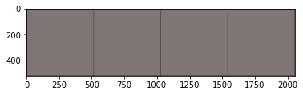
    


    Epoch 0: Step 200: Generator (U-Net) loss: 52.46482770919802, Discriminator loss: 0.6408292359113699
    


    
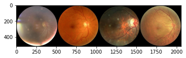
    


    
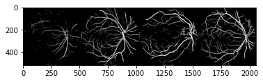
    


    

    


    Epoch 0: Step 400: Generator (U-Net) loss: 44.93029767036437, Discriminator loss: 0.3824089297652243
    


    
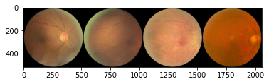
    


    

    


    

    


    Epoch 1: Step 600: Generator (U-Net) loss: 33.83245618820189, Discriminator loss: 0.25708449937403194
    


    

    


    

    


    

    


    Epoch 1: Step 800: Generator (U-Net) loss: 27.038341903686547, Discriminator loss: 0.12598866902291786
    


    

    


    

    


    

    


    Epoch 2: Step 1000: Generator (U-Net) loss: 24.62309978485109, Discriminator loss: 0.06050973799079659
    


    

    


    

    


    

    


    Epoch 2: Step 1200: Generator (U-Net) loss: 23.124661002159122, Discriminator loss: 0.03553965166211128
    


    

    


    

    


    

    


    Epoch 3: Step 1400: Generator (U-Net) loss: 21.25410917282105, Discriminator loss: 0.2585765695944429
    


    

    


    

    


    

    


    Epoch 3: Step 1600: Generator (U-Net) loss: 20.7684798192978, Discriminator loss: 0.18324331607669597
    


    

    


    

    


    

    


    Epoch 3: Step 1800: Generator (U-Net) loss: 21.21658486843109, Discriminator loss: 0.026128428475931286
    


    

    


    

    


    

    


    Epoch 4: Step 2000: Generator (U-Net) loss: 22.123379473686224, Discriminator loss: 0.0170011700410396
    


    

    


    

    


    

    


    Epoch 4: Step 2200: Generator (U-Net) loss: 20.941478252410878, Discriminator loss: 0.06591212144587191
    


    

    


    

    


    

    


    Epoch 5: Step 2400: Generator (U-Net) loss: 18.551384806632992, Discriminator loss: 0.4075392137095334
    


    

    


    

    


    

    


    Epoch 5: Step 2600: Generator (U-Net) loss: 19.37798899650575, Discriminator loss: 0.1957894230447711
    


    

    


    

    


    

    


    Epoch 6: Step 2800: Generator (U-Net) loss: 19.09459172248841, Discriminator loss: 0.20214518136810505
    


    

    


    

    


    

    


    Epoch 6: Step 3000: Generator (U-Net) loss: 19.20126194477082, Discriminator loss: 0.25998362509533757
    


    

    


    

    


    

    


    Epoch 6: Step 3200: Generator (U-Net) loss: 17.592603716850295, Discriminator loss: 0.42042010890319953
    


    

    


    

    


    

    


    Epoch 7: Step 3400: Generator (U-Net) loss: 17.36779361248017, Discriminator loss: 0.44014838546514506
    


    

    


    

    


    

    


    Epoch 7: Step 3600: Generator (U-Net) loss: 16.46069777965546, Discriminator loss: 0.5637747962772841
    


    

    


    

    


    

    


    Epoch 8: Step 3800: Generator (U-Net) loss: 15.786085453033445, Discriminator loss: 0.5743345548957587
    


    

    


    

    


    

    


    Epoch 8: Step 4000: Generator (U-Net) loss: 16.327435817718506, Discriminator loss: 0.5351156285405161
    


    

    


    

    


    

    


    Epoch 9: Step 4200: Generator (U-Net) loss: 15.796210246086117, Discriminator loss: 0.5940861061960462
    


    

    


    

    


    

    


    Epoch 9: Step 4400: Generator (U-Net) loss: 15.309932565689099, Discriminator loss: 0.5718528483062987
    


    

    


    

    


    

    


    Epoch 9: Step 4600: Generator (U-Net) loss: 15.604188284873958, Discriminator loss: 0.5589309097826483
    


    

    


    

    


    

    


    Epoch 10: Step 4800: Generator (U-Net) loss: 15.35258427619935, Discriminator loss: 0.5633312847465274
    


    

    


    

    


    

    


    Epoch 10: Step 5000: Generator (U-Net) loss: 15.272418904304505, Discriminator loss: 0.563543492406607
    


    

    


    

    


    

    


    Epoch 11: Step 5200: Generator (U-Net) loss: 14.911911058425899, Discriminator loss: 0.6039275236427781
    


    

    


    

    


    

    


    Epoch 11: Step 5400: Generator (U-Net) loss: 15.01147954940796, Discriminator loss: 0.543950648754835
    


    

    


    

    


    

    


    Epoch 12: Step 5600: Generator (U-Net) loss: 15.068673787117005, Discriminator loss: 0.5008977087587121
    


    

    


    

    


    

    


    Epoch 12: Step 5800: Generator (U-Net) loss: 15.088388924598696, Discriminator loss: 0.49634317822754365
    


    

    


    

    


    

    


    Epoch 12: Step 6000: Generator (U-Net) loss: 14.925498719215398, Discriminator loss: 0.4236111663281919
    


    

    


    

    


    

    


    Epoch 13: Step 6200: Generator (U-Net) loss: 15.02654624462127, Discriminator loss: 0.349321171361953
    


    

    


    

    


    

    


    Epoch 13: Step 6400: Generator (U-Net) loss: 15.361308097839357, Discriminator loss: 0.30512543072924025
    


    

    


    

    


    

    


    Epoch 14: Step 6600: Generator (U-Net) loss: 15.024779133796695, Discriminator loss: 0.41992817364633084
    


    

    


    

    


    

    


    Epoch 14: Step 6800: Generator (U-Net) loss: 14.677514123916612, Discriminator loss: 0.4989471133798357
    


    

    


    

    


    

    


    Epoch 15: Step 7000: Generator (U-Net) loss: 15.165476856231678, Discriminator loss: 0.36930760577321076
    


    

    


    

    


    

    


    Epoch 15: Step 7200: Generator (U-Net) loss: 15.89894622802734, Discriminator loss: 0.3400735027901828
    


    

    


    

    


    

    


    Epoch 15: Step 7400: Generator (U-Net) loss: 14.142220945358288, Discriminator loss: 0.5264257546514274
    


    

    


    

    


    

    


    Epoch 16: Step 7600: Generator (U-Net) loss: 14.640405068397518, Discriminator loss: 0.45140052106231454
    


    

    


    

    


    

    


    Epoch 16: Step 7800: Generator (U-Net) loss: 14.23081113338471, Discriminator loss: 0.4928330842778087
    


    

    


    

    


    

    


    Epoch 17: Step 8000: Generator (U-Net) loss: 14.365247821807866, Discriminator loss: 0.4132874688878656
    


    

    


    

    


    

    


    Epoch 17: Step 8200: Generator (U-Net) loss: 13.811207842826848, Discriminator loss: 0.49831123992800735
    


    

    


    

    


    

    


    Epoch 18: Step 8400: Generator (U-Net) loss: 13.340272712707515, Discriminator loss: 0.6497187440842389
    


    

    


    

    


    

    


    Epoch 18: Step 8600: Generator (U-Net) loss: 13.199333024024972, Discriminator loss: 0.5171704695373772
    


    

    


    

    


    

    


    Epoch 18: Step 8800: Generator (U-Net) loss: 13.753638467788706, Discriminator loss: 0.537200129926205
    


    

    


    

    


    

    


    Epoch 19: Step 9000: Generator (U-Net) loss: 13.221205992698662, Discriminator loss: 0.5512313174456356
    


    

    


    

    


    

    


    Epoch 19: Step 9200: Generator (U-Net) loss: 12.780668587684643, Discriminator loss: 0.553384855017066
    


    

    


    

    


    

    


    Epoch 20: Step 9400: Generator (U-Net) loss: 12.672384309768676, Discriminator loss: 0.5340735790133477
    


    

    


    

    


    

    


    Epoch 20: Step 9600: Generator (U-Net) loss: 13.009267811775207, Discriminator loss: 0.6000304725766186
    


    

    


    

    


    

    


    Epoch 21: Step 9800: Generator (U-Net) loss: 12.715570578575129, Discriminator loss: 0.5476747442036869
    


    

    


    

    


    

    


    Epoch 21: Step 10000: Generator (U-Net) loss: 12.55386628150941, Discriminator loss: 0.5232586279883981
    


    

    


    

    


    

    


    Epoch 21: Step 10200: Generator (U-Net) loss: 12.833216331005103, Discriminator loss: 0.6019930065423255
    


    

    


    

    


    

    


    Epoch 22: Step 10400: Generator (U-Net) loss: 12.255184249877935, Discriminator loss: 0.5748726470023391
    


    

    


    

    


    

    


    Epoch 22: Step 10600: Generator (U-Net) loss: 12.16266835927963, Discriminator loss: 0.6017312294244763
    


    

    


    

    


    

    


    Epoch 23: Step 10800: Generator (U-Net) loss: 11.873478162288668, Discriminator loss: 0.5276154362410308
    


    

    


    

    


    

    


    Epoch 23: Step 11000: Generator (U-Net) loss: 12.08023518323898, Discriminator loss: 0.5622009706497191
    


    

    


    

    


    

    


    Epoch 24: Step 11200: Generator (U-Net) loss: 12.065670070648196, Discriminator loss: 0.572480154931545
    


    

    


    

    


    

    


    Epoch 24: Step 11400: Generator (U-Net) loss: 12.033194227218626, Discriminator loss: 0.5244859121739863
    


    

    


    

    


    

    


    Epoch 24: Step 11600: Generator (U-Net) loss: 12.01952377557754, Discriminator loss: 0.5497414322197438
    


    

    


    

    


    

    


    Epoch 25: Step 11800: Generator (U-Net) loss: 11.585048260688787, Discriminator loss: 0.5539422848820688
    


    

    


    

    


    

    


    Epoch 25: Step 12000: Generator (U-Net) loss: 11.847832317352301, Discriminator loss: 0.5012211321294309
    


    

    


    

    


    

    


    Epoch 26: Step 12200: Generator (U-Net) loss: 11.87876566410065, Discriminator loss: 0.5430263146758078
    


    

    


    

    


    

    


    Epoch 26: Step 12400: Generator (U-Net) loss: 11.17699061393737, Discriminator loss: 0.5245204541832208
    


    

    


    

    


    

    


    Epoch 27: Step 12600: Generator (U-Net) loss: 11.592132363319404, Discriminator loss: 0.5390707110613586
    


    

    


    

    


    

    


    Epoch 27: Step 12800: Generator (U-Net) loss: 11.470494666099546, Discriminator loss: 0.5289198628440499
    


    

    


    

    


    

    


    Epoch 27: Step 13000: Generator (U-Net) loss: 11.315167849063878, Discriminator loss: 0.5641437524557116
    


    

    


    

    


    

    


    Epoch 28: Step 13200: Generator (U-Net) loss: 11.563940320014959, Discriminator loss: 0.5594559662044046
    


    

    


    

    


    

    


    Epoch 28: Step 13400: Generator (U-Net) loss: 11.338511209487919, Discriminator loss: 0.5244684281200173
    


    

    


    

    


    

    


    Epoch 29: Step 13600: Generator (U-Net) loss: 10.997653491497042, Discriminator loss: 0.5551282133162022
    


    

    


    

    


    

    


    Epoch 29: Step 13800: Generator (U-Net) loss: 10.919450173377987, Discriminator loss: 0.5971719300746916
    


    

    


    

    


    

    


    Epoch 30: Step 14000: Generator (U-Net) loss: 10.948727667331697, Discriminator loss: 0.5408717187494042
    


    

    


    

    


    

    


    Epoch 30: Step 14200: Generator (U-Net) loss: 10.77516280174256, Discriminator loss: 0.544995616450906
    


    

    


    

    


    

    


    Epoch 30: Step 14400: Generator (U-Net) loss: 11.038678736686704, Discriminator loss: 0.5619006096571686
    


    

    


    

    


    

    


    Epoch 31: Step 14600: Generator (U-Net) loss: 10.516819207668307, Discriminator loss: 0.5565231903642418
    


    

    


    

    


    

    


    Epoch 31: Step 14800: Generator (U-Net) loss: 10.490289268493648, Discriminator loss: 0.5651251454651351
    


    

    


    

    


    

    


    Epoch 32: Step 15000: Generator (U-Net) loss: 10.584110949039456, Discriminator loss: 0.5822095587849621
    


    

    


    

    


    

    


    Epoch 32: Step 15200: Generator (U-Net) loss: 10.365930707454682, Discriminator loss: 0.5993096655607226
    


    

    


    

    


    

    


    Epoch 33: Step 15400: Generator (U-Net) loss: 10.105796558856959, Discriminator loss: 0.5619678379595275
    


    

    


    

    


    

    


    Epoch 33: Step 15600: Generator (U-Net) loss: 10.494147965908052, Discriminator loss: 0.5415366851538421
    


    

    


    

    


    

    


    Epoch 33: Step 15800: Generator (U-Net) loss: 10.10233927726746, Discriminator loss: 0.5814128223061563
    


    

    


    

    


    

    


    Epoch 34: Step 16000: Generator (U-Net) loss: 9.661860053539273, Discriminator loss: 0.6183101832866674
    


    

    


    

    


    

    


    Epoch 34: Step 16200: Generator (U-Net) loss: 9.996857042312632, Discriminator loss: 0.5504163563251495
    


    

    


    

    


    

    


    Epoch 35: Step 16400: Generator (U-Net) loss: 9.766125333309173, Discriminator loss: 0.5666019840538503
    


    

    


    

    


    

    


    Epoch 35: Step 16600: Generator (U-Net) loss: 9.898074491024019, Discriminator loss: 0.5808742870390418
    


    

    


    

    


    

    


    Epoch 36: Step 16800: Generator (U-Net) loss: 10.05018318891525, Discriminator loss: 0.5435656126588579
    


    

    


    

    


    

    


    Epoch 36: Step 17000: Generator (U-Net) loss: 9.738629813194281, Discriminator loss: 0.5915006077289581
    


    

    


    

    


    

    


    Epoch 36: Step 17200: Generator (U-Net) loss: 9.734701523780828, Discriminator loss: 0.5810938463360071
    


    

    


    

    


    

    


    Epoch 37: Step 17400: Generator (U-Net) loss: 9.256361927986147, Discriminator loss: 0.596777133792639
    


    

    


    

    


    

    


    Epoch 37: Step 17600: Generator (U-Net) loss: 9.573990066051486, Discriminator loss: 0.5646070724725722
    


    

    


    

    


    

    


    Epoch 38: Step 17800: Generator (U-Net) loss: 9.458319563865661, Discriminator loss: 0.5707471580058334
    


    

    


    

    


    

    


    Epoch 38: Step 18000: Generator (U-Net) loss: 9.510613408088686, Discriminator loss: 0.5644181104749442
    


    

    


    

    


    

    


    Epoch 39: Step 18200: Generator (U-Net) loss: 9.34928073167801, Discriminator loss: 0.5911390881985422
    


    

    


    

    


    

    


    Epoch 39: Step 18400: Generator (U-Net) loss: 9.136145620346067, Discriminator loss: 0.5975072582066063
    


    

    


    

    


    

    


    Epoch 39: Step 18600: Generator (U-Net) loss: 9.004914281368261, Discriminator loss: 0.6259905864298342
    


    

    


    

    


    

    


    Epoch 40: Step 18800: Generator (U-Net) loss: 9.235972428321844, Discriminator loss: 0.6090840595960616
    


    

    


    

    


    

    


    Epoch 40: Step 19000: Generator (U-Net) loss: 8.91376308202744, Discriminator loss: 0.5917609881609674
    


    

    


    

    


    

    


    Epoch 41: Step 19200: Generator (U-Net) loss: 9.268049499988559, Discriminator loss: 0.5506441421806809
    


    

    


    

    


    

    


    Epoch 41: Step 19400: Generator (U-Net) loss: 9.092741999626163, Discriminator loss: 0.584408386349678
    


    

    


    

    


    

    


    Epoch 42: Step 19600: Generator (U-Net) loss: 8.97241967439652, Discriminator loss: 0.5909209805727009
    


    

    


    

    


    

    


    Epoch 42: Step 19800: Generator (U-Net) loss: 8.834741139411923, Discriminator loss: 0.5571738304942846
    


    

    


    

    


    

    


    Epoch 42: Step 20000: Generator (U-Net) loss: 8.683477342128754, Discriminator loss: 0.6295558443665503
    


    

    


    

    


    

    


    Epoch 43: Step 20200: Generator (U-Net) loss: 8.636891114711766, Discriminator loss: 0.6267808697372674
    


    

    


    

    


    

    


    Epoch 43: Step 20400: Generator (U-Net) loss: 8.548097536563874, Discriminator loss: 0.5963472524285319
    


    

    


    

    


    

    


    Epoch 44: Step 20600: Generator (U-Net) loss: 8.740780816078189, Discriminator loss: 0.5823457930237058
    


    

    


    

    


    

    


    Epoch 44: Step 20800: Generator (U-Net) loss: 8.568996372222902, Discriminator loss: 0.5826686953008172
    


    

    


    

    


    

    


    Epoch 45: Step 21000: Generator (U-Net) loss: 8.657251267433166, Discriminator loss: 0.5825450591742993
    


    

    


    

    


    

    


    Epoch 45: Step 21200: Generator (U-Net) loss: 8.360435013771056, Discriminator loss: 0.6020312575250867
    


    

    


    

    


    

    


    Epoch 45: Step 21400: Generator (U-Net) loss: 8.493312695026395, Discriminator loss: 0.5671911882609129
    


    

    


    

    


    

    


    Epoch 46: Step 21600: Generator (U-Net) loss: 8.361584975719454, Discriminator loss: 0.6076765740662813
    


    

    


    

    


    

    


    Epoch 46: Step 21800: Generator (U-Net) loss: 8.473430678844451, Discriminator loss: 0.6104270809888843
    


    

    


    

    


    

    


    Epoch 47: Step 22000: Generator (U-Net) loss: 8.482928881645202, Discriminator loss: 0.5948556883633137
    


    

    


    

    


    

    


    Epoch 47: Step 22200: Generator (U-Net) loss: 8.154896392822268, Discriminator loss: 0.6210964620113376
    


    

    


    

    


    

    


    Epoch 48: Step 22400: Generator (U-Net) loss: 8.453690104484556, Discriminator loss: 0.6007121166586878
    


    

    


    

    


    

    


    Epoch 48: Step 22600: Generator (U-Net) loss: 8.286154940128325, Discriminator loss: 0.6035485128313303
    


    

    


    

    


    

    


    Epoch 48: Step 22800: Generator (U-Net) loss: 8.133513925075532, Discriminator loss: 0.6001232493668794
    


    

    


    

    


    

    


    Epoch 49: Step 23000: Generator (U-Net) loss: 8.435312154293062, Discriminator loss: 0.6366416804492472
    


    

    


    

    


    

    


    Epoch 49: Step 23200: Generator (U-Net) loss: 7.931170160770418, Discriminator loss: 0.6146333284676073
    


    

    


    

    


    

    


    Epoch 50: Step 23400: Generator (U-Net) loss: 8.167942233085634, Discriminator loss: 0.5987573345005511
    


    

    


    

    


    

    


    Epoch 50: Step 23600: Generator (U-Net) loss: 8.144440662860871, Discriminator loss: 0.58312982223928
    


    

    


    

    


    

    


    Epoch 51: Step 23800: Generator (U-Net) loss: 7.981751627922053, Discriminator loss: 0.6259574723988774
    


    

    


    

    


    

    


    Epoch 51: Step 24000: Generator (U-Net) loss: 8.032577598094942, Discriminator loss: 0.5882394541800023
    


    

    


    

    


    

    


    Epoch 51: Step 24200: Generator (U-Net) loss: 7.986506166458131, Discriminator loss: 0.6034535127878191
    


    

    


    

    


    

    


    Epoch 52: Step 24400: Generator (U-Net) loss: 7.898453428745268, Discriminator loss: 0.6116383324563504
    


    

    


    

    


    

    


    Epoch 52: Step 24600: Generator (U-Net) loss: 7.982549576759339, Discriminator loss: 0.6078894490003586
    


    

    


    

    


    

    


    Epoch 53: Step 24800: Generator (U-Net) loss: 7.840874252319342, Discriminator loss: 0.6013284813612699
    


    

    


    

    


    

    


    Epoch 53: Step 25000: Generator (U-Net) loss: 7.8039536070823665, Discriminator loss: 0.5806936464458708
    


    

    


    

    


    

    


    Epoch 54: Step 25200: Generator (U-Net) loss: 7.643192324638368, Discriminator loss: 0.5882720114290719
    


    

    


    

    


    

    


    Epoch 54: Step 25400: Generator (U-Net) loss: 7.722957003116606, Discriminator loss: 0.6218619191646576
    


    

    


    

    


    

    


    Epoch 54: Step 25600: Generator (U-Net) loss: 7.543678371906287, Discriminator loss: 0.6441167706251144
    


    

    


    

    


    

    


    Epoch 55: Step 25800: Generator (U-Net) loss: 7.7378231263160755, Discriminator loss: 0.5903166390210391
    


    

    


    

    


    

    


    Epoch 55: Step 26000: Generator (U-Net) loss: 7.579036321640016, Discriminator loss: 0.644935392588377
    


    

    


    

    


    

    


    Epoch 56: Step 26200: Generator (U-Net) loss: 7.531041111946104, Discriminator loss: 0.6087161214649677
    


    

    


    

    


    

    


    Epoch 56: Step 26400: Generator (U-Net) loss: 7.614216177463534, Discriminator loss: 0.6210830762982369
    


    

    


    

    


    

    


    Epoch 57: Step 26600: Generator (U-Net) loss: 7.418335602283475, Discriminator loss: 0.623887641429901
    


    

    


    

    


    

    


    Epoch 57: Step 26800: Generator (U-Net) loss: 7.413139448165891, Discriminator loss: 0.6195812321454283
    


    

    


    

    


    

    


    Epoch 57: Step 27000: Generator (U-Net) loss: 7.5577192306518555, Discriminator loss: 0.5993185633420943
    


    

    


    

    


    

    


    Epoch 58: Step 27200: Generator (U-Net) loss: 7.453517360687256, Discriminator loss: 0.6276462447643278
    


    

    


    

    


    

    


    Epoch 58: Step 27400: Generator (U-Net) loss: 7.246000390052795, Discriminator loss: 0.604410396143794
    


    

    


    

    


    

    


    Epoch 59: Step 27600: Generator (U-Net) loss: 7.388180525302884, Discriminator loss: 0.6215704169869426
    


    

    


    

    


    

    


    Epoch 59: Step 27800: Generator (U-Net) loss: 7.225581369400022, Discriminator loss: 0.6246555268019436
    


    

    


    

    


    

    


    Epoch 60: Step 28000: Generator (U-Net) loss: 7.437454600334169, Discriminator loss: 0.6196156658232208
    


    

    


    

    


    

    


    Epoch 60: Step 28200: Generator (U-Net) loss: 7.230567984580992, Discriminator loss: 0.6210672846436501
    


    

    


    

    


    

    


    Epoch 60: Step 28400: Generator (U-Net) loss: 7.450877540111537, Discriminator loss: 0.6399757929891348
    


    

    


    

    


    

    


    Epoch 61: Step 28600: Generator (U-Net) loss: 7.2039382362365725, Discriminator loss: 0.6419419240951538
    


    

    


    

    


    

    


    Epoch 61: Step 28800: Generator (U-Net) loss: 7.173999564647674, Discriminator loss: 0.6197565411031246
    


    

    


    

    


    

    


    Epoch 62: Step 29000: Generator (U-Net) loss: 7.101286325454714, Discriminator loss: 0.6064659295976166
    


    

    


    

    


    

    


    Epoch 62: Step 29200: Generator (U-Net) loss: 7.131996757984159, Discriminator loss: 0.6203482546657324
    


    

    


    

    


    

    


    Epoch 63: Step 29400: Generator (U-Net) loss: 7.265620002746581, Discriminator loss: 0.6186644597351548
    


    

    


    

    


    

    


    Epoch 63: Step 29600: Generator (U-Net) loss: 6.9575718522071845, Discriminator loss: 0.631886478215456
    


    

    


    

    


    

    


    Epoch 63: Step 29800: Generator (U-Net) loss: 7.163659732341764, Discriminator loss: 0.6153849122673273
    


    

    


    

    


    

    


    Epoch 64: Step 30000: Generator (U-Net) loss: 6.9297455811500575, Discriminator loss: 0.6341720418632032
    


    

    


    

    


    

    


    Epoch 64: Step 30200: Generator (U-Net) loss: 6.917034459114073, Discriminator loss: 0.623916437327862
    


    

    


    

    


    

    


    Epoch 65: Step 30400: Generator (U-Net) loss: 6.860779623985289, Discriminator loss: 0.6243686932325365
    


    

    


    

    


    

    


    Epoch 65: Step 30600: Generator (U-Net) loss: 6.793545405864719, Discriminator loss: 0.637522247955203
    


    

    


    

    


    

    


    Epoch 66: Step 30800: Generator (U-Net) loss: 7.016542189121245, Discriminator loss: 0.623966294229031
    


    

    


    

    


    

    


    Epoch 66: Step 31000: Generator (U-Net) loss: 6.7345853638649, Discriminator loss: 0.6175943006575105
    


    

    


    

    


    

    


```python

```

