**Abstract**: The two major challenges in applying deep learning to develop a computer-aided diagnosis for retinal images is lack of access to enough amount of annotated data and legal concerns regarding patient privacy. Due to the expertise needed to annotate retinal images and the legal issue raised when using patient image data, it is difficult to obtain sufficient amount of labeled retinal images. Various kinds of effort are being made to increase the amount of data either by augmenting training images or by synthesizing real-looking retinal images. However, augmentation is limited to the amount of available data and it doesn't solve the concern of patient privacy. In this paper, we propose a GAN based fundus image synthesis method (FundusGAN) that generates synthetic training images to solve the above problems. The proposed method is an improved way of generating retinal images by following a two-step generation process which involves first training a segmentation network to extract the vessel tree followed by vessel tree to fundus image-to-image translation using unsupervised generative attention networks with adaptive layer-instance normalization. Our experiments result shows that the proposed fundusGAN exceeds state-of-the-art generative models for retinal image synthesis in different GAN metrics. Our method also validates that generated retinal images can be used to train retinal image classifiers for eye diseases diagnosis.


# How to run?
## FundusGAN-I

```python
from google.colab import drive
drive.mount('/content/drive')
```

    Mounted at /content/drive
    


```python
cd /content/drive/MyDrive/RP/Summer21
```

    /content/drive/MyDrive/RP/Summer21
    


```python
cd Fundus-GAN-version-1/
```

    /content/drive/My Drive/RP/Summer21/Fundus-GAN-version-1
    


**1. Segmentation**


```python
device = 'cuda'
```


```python
from torch.utils.data import DataLoader
import torch
from src.utils.config import *
from src.models.unet import *
from src.models.pix2pix_gen import UNet_pix2pix
from src.dataset.dataset import *
from src.models.discriminator import Discriminator
from train_pix2pix import *
from train import *
device = 'cuda' if torch.cuda.is_available() else 'cpu'
print(device)
```

    cuda
    


```python
train_input_path = datapath_cfg['train_input_path']
train_label_path = datapath_cfg['train_label_path']
batch_size = cfg['batch_size']
print(train_input_path)
```

    /content/drive/MyDrive/RP/Summer21/dataset/newi.tiff
    


```python
train_dataset = unet_dataset(train_input_path, train_label_path)
```


```python
train_dataloader = DataLoader(train_dataset, batch_size=batch_size, shuffle=True)
```


```python
unet = UNet(input_channels=cfg['input_dim'], output_channels=cfg['output_dim']).to(device)
```


```python
unet_opt = torch.optim.Adam(unet.parameters(), lr=cfg['lr'])
```


```python
unet = UNet(input_channels=cfg['input_dim'], output_channels=cfg['output_dim'])
checkpoint = torch.load('/content/drive/MyDrive/RP/F21/Models/UNET/unet_v_26-09-202114:30:12.pth')
unet.load_state_dict(checkpoint['unet'])
unet.to(device)
```


```python
train(model=unet, optimizer=unet_opt, 
      criterion=cfg['criterion'],
      train_dataloader=train_dataloader, 
      input_dim=cfg['input_dim'], 
      label_dim=cfg['output_dim'], 
      target_shape=cfg['target_shape'],
      device=device, save_dir = "/content/drive/MyDrive/RP/F21/Models/UNET")
```

    Epoch 0: Step 5: U-Net loss: 0.05962532386183739
    


    

    


    

    


    

    


    Epoch 6: Step 205: U-Net loss: 0.04562734067440033
    


    

    


    

    


    

    


    Epoch 11: Step 405: U-Net loss: 0.05267468839883804
    


    

    


    

    


    

    


    Epoch 17: Step 605: U-Net loss: 0.04996743053197861
    
.
.
.
.

    

.
.
.
.  

    
.
.
.
.  


    Epoch 382: Step 13005: U-Net loss: 0.06173957884311676
    


    

    


    

    


    

    


    Epoch 388: Step 13205: U-Net loss: 0.04220299422740936
    


    

    


    

    


    

    


    ---------------------------------------------------------------------------

    KeyboardInterrupt                         Traceback (most recent call last)

    <ipython-input-16-5dcd1309c74a> in <module>()
          5       label_dim=cfg['output_dim'],
          6       target_shape=cfg['target_shape'],
    ----> 7       device=device, save_dir = "/content/drive/MyDrive/RP/F21/Models/UNET")
    

    /content/drive/My Drive/RP/Summer21/Fundus-GAN-version-1/train.py in train(model, optimizer, criterion, train_dataloader, input_dim, label_dim, target_shape, device, save_dir)
         24             # Flatten the image
         25 
    ---> 26             real = real.to(device)
         27             labels = labels.to(device)
         28             ### Update U-Net ###
    

    KeyboardInterrupt: 


**2. Image generation**


```python
pix2pix_dataset = pix2pix_dataset('/content/drive/MyDrive/RP/Summer21/dataset/maps')
```


```python
dataloader = DataLoader(pix2pix_dataset, batch_size=pix2pix_config['batch_size'], shuffle=True)
```


```python
unet_pix2pix = UNet_pix2pix(input_channels=pix2pix_config['input_dim'],output_channels=pix2pix_config['real_dim']).to(device)
```


```python
unet_opt = torch.optim.Adam(unet_pix2pix.parameters(), lr=pix2pix_config['lr'])
```


```python
disc = Discriminator(pix2pix_config['input_dim'] + pix2pix_config['real_dim']).to(device)
```


```python
disc_opt = torch.optim.Adam(disc.parameters(), lr=pix2pix_config['lr'])
```


```python
model = {'gen':unet_pix2pix, 'disc':disc}
optimizer = {'gen_opt':unet_opt, 'disc_opt':disc_opt}
pix2pix_criteria = {'adv_criterion':pix2pix_config['adv_criterion'], 'recon_criterion':pix2pix_config['recon_criterion']}
```


```python
train_pix2pix(model=model, optimizer=optimizer, criterion=pix2pix_criteria, dataloader = dataloader, input_dim=pix2pix_config['real_dim'],
              label_dim=pix2pix_config['real_dim'], target_shape=pix2pix_config['target_shape'],
              device='cuda')
```

    Loading pretrained initial state
    


    

    


    

    


    

    


    Epoch 0: Step 200: Generator (U-Net) loss: 52.46482770919802, Discriminator loss: 0.6408292359113699
    


    

    


    

    


    

    


    Epoch 0: Step 400: Generator (U-Net) loss: 44.93029767036437, Discriminator loss: 0.3824089297652243
    


    

    


    
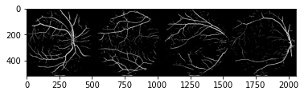
    


    
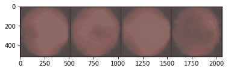
    


    Epoch 1: Step 600: Generator (U-Net) loss: 33.83245618820189, Discriminator loss: 0.25708449937403194
    


    
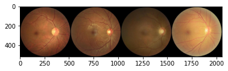
    


    
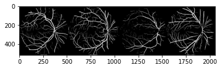
    


    
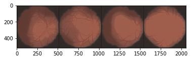
    

.
.
.
.
.
.
.


.
.
.
.
.
.
.


.
.
.
.
.
.
.
.

  


 Epoch 63: Step 29600: Generator (U-Net) loss: 7.163659732341764, Discriminator loss: 0.6153849122673273
    


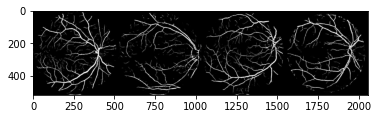
    


    
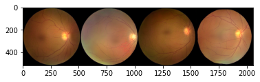
    


    Epoch 63: Step 29800: Generator (U-Net) loss: 7.163659732341764, Discriminator loss: 0.6153849122673273
    


    
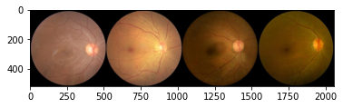
    


    
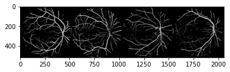
    


    
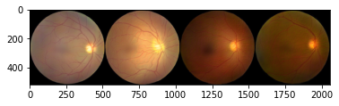
    


    Epoch 64: Step 30000: Generator (U-Net) loss: 6.9297455811500575, Discriminator loss: 0.6341720418632032
    


    
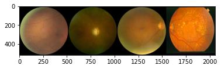
    


    
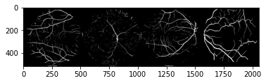
    


    
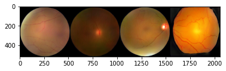
    


    Epoch 64: Step 30200: Generator (U-Net) loss: 6.917034459114073, Discriminator loss: 0.623916437327862
    


    
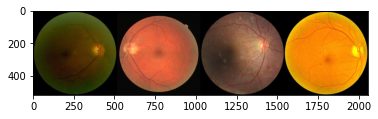
    


    
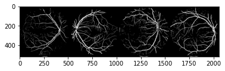
    


    
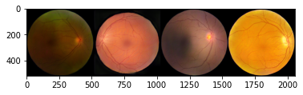
    


    Epoch 65: Step 30400: Generator (U-Net) loss: 6.860779623985289, Discriminator loss: 0.6243686932325365
    


    
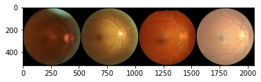
    


    
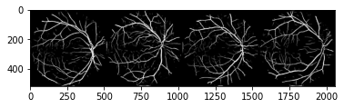
    


    
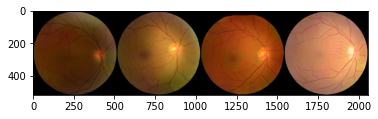
    


    Epoch 65: Step 30600: Generator (U-Net) loss: 6.793545405864719, Discriminator loss: 0.637522247955203
    


    
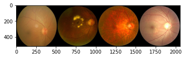
    


    
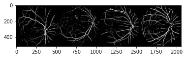
    


    
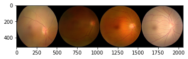
    


    Epoch 66: Step 30800: Generator (U-Net) loss: 7.016542189121245, Discriminator loss: 0.623966294229031
    


    
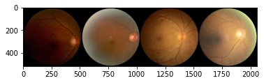
    


    
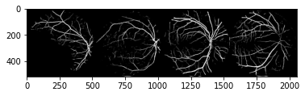
    


    
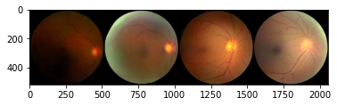
    


    Epoch 66: Step 31000: Generator (U-Net) loss: 6.7345853638649, Discriminator loss: 0.6175943006575105
    


    
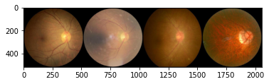
    


    
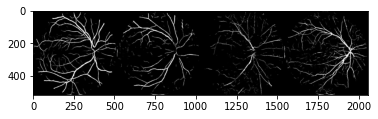
    


    
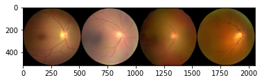
    


```python

```

